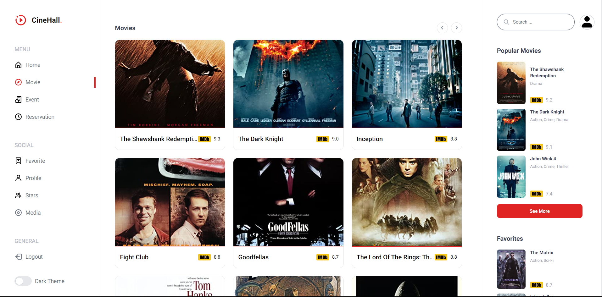
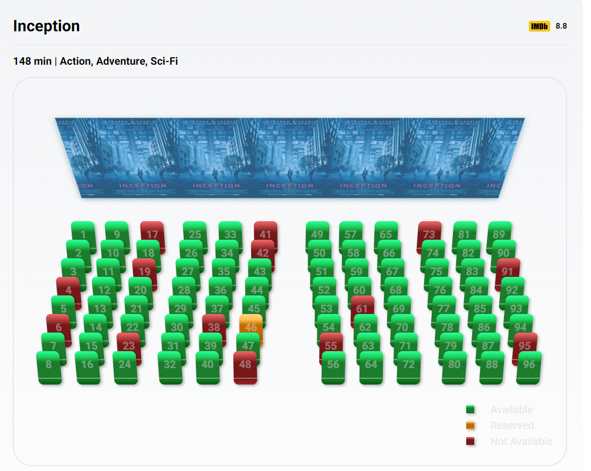
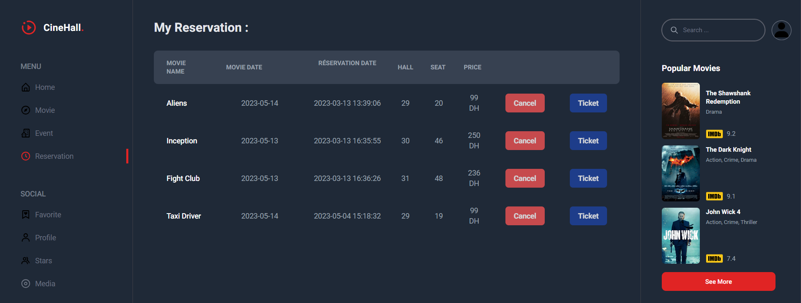

# CineHall

Context of the project
CineHall wants to implement an online reservation for cinema tickets for the benefit of their users, they call on your
skills as a full stack developer to achieve this.

​

Instructions :

​

When registering a new user, a unique reference number will be generated by the system for the identification of the
user (Optional sending of the reference by email).

Users will be able to enter the necessary information and reserve seats to see the film of their choice on a specific
date.

After authentication, users will be able to view their previous reservations.

Reservations can be canceled by users themselves.

Each room can only accommodate one film at a time and a full room will not be available for reservation.

There will be at least 3 rooms available for reservations.

Past dates will not be included in the booking options.

Reserved seats will be unavailable.

​

Ex: Reservation table characterized by the room, the film, the reservation date, reserved seat number.

The films will be shown in theaters at 8 p.m. every day of the week, except Sunday.

​

Technological constraints:

​

Backend: PHP API (POO) respecting the MVC design pattern.
Frontend: Choice between VueJS / ReactJS or native JS (API consumption)
​

​

Bonuses:

​

Suggestion of the best film of the month.

Search for two places next to a filter.

Generation of the reservation ticket.

Admin dashboard to manage reservations, movies and rooms.

Use authentication by JWT.

Performance criteria
Validation of forms at the authentication level.
Use of APIs.
Login system implementation.
Have at least three tables.
